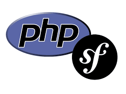

<!--
---
author: krbe23
revision:
    "2023-03-29": "(A, krbe23) First release" (alot copied from mos readme.md in this course...)
---
-->



Object-oriented web technologies
=========================================

This repo is a part of the course MVC at BTH. 

We work with Symfony framework to learn about Object-oriented web technologies. This repo is made from a Symfony skeleton.

Requirements
------------------------------
You need to have npm, PHP and Composer installed in the terminal. If not please do now.

Start up the web app
------------------

I assume you are in my course repo. Please change the -rsync to your preferred path.

```
# Go to the root of the course repo
rsync -av me/report me/cloned_report
cd me/cloned_report/report
```

To run the site local
----------------------

Start the PHP built-in server
```
php -S localhost:8888 -t public
```

You should now be able to open a web browser and see the web-site at `http://localhost:8888`.

When you start to modify the css and javascript in the app you need to run a npm script to create the directory public/build. 
```
npm run build
```
Or use the script that watch for changes
```
npm run watch
```


Good commands to use for your terminal.
-----------------------------

Run your app local

```
php -S localhost:8888 -t public
```

The tool bin/console can help develop and troubleshoot your application.

Here are a few examples on how to use it.

```
# Show the routes
bin/console debug:router
```
```
# Match a specific route
bin/console router:match /lucky/number
```
```
# Clear the cache
bin/console cache:clear
```
```
# Show available commands
bin/console
```
